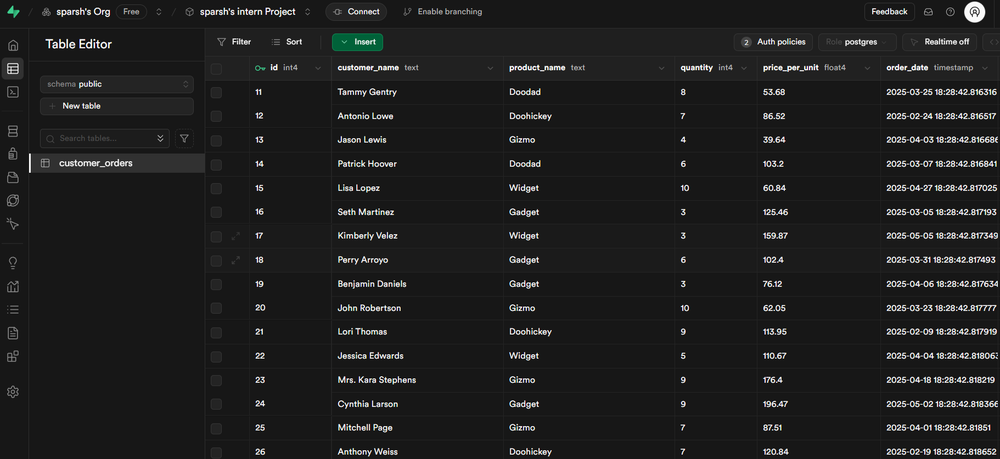

# End-to-End Data Pipeline

## Required Submissions

- **Postgres database URL**: [db url](postgresql://postgres:<your-db-password>@db.<project-id>.supabase.co:5432/postgres)

    - Since in order to view the database you have to be a user of Supabase so here is an image showing the layout and presence of the database.

    

- dummy data generation script : [click here](./dummy_data_gen.py)

- analysis script: [click here](./data_analysis.py) 

- challenges faced: [click here](./challenges_faced.md)

## Overview

This project demonstrates a mini data pipeline covering database setup, dummy data generation, data analysis, and using an LLM for business insights.  

---

## Tech Stack & Python Libraries

- **Database:** PostgreSQL (hosted on Supabase)
- **Backend Language:** Python 3
- **Main Python Libraries:**
  - `supabase` (connects to Supabase/Postgres)
  - `faker` (generates random but realistic dummy data)
  - `pandas` (data manipulation and analysis)
  - `google-generativeai` (for Google Gemini LLM)
  - `random`, `datetime` (Python built-in modules)

---

## Project Structure

- **dummy_data_generation.py**  
  Script to generate and insert 500 random customer order records into the cloud Postgres database.

- **analysis.py**  
  Script to fetch data from the database, analyze it with Pandas, and summarize the findings using the Gemini LLM.

---

## How I Worked with the LLM (Gemini) and Why I Used It

For the final step, I needed to summarize my analysis results and generate a marketing insight automatically.  
Instead of OpenAI, I chose Google Gemini because it’s free to use, easy to set up, and has a generous quota for testing.  
I used the `google-generativeai` Python library, which allowed me to send my analysis as a prompt to Gemini and get back a concise, executive-friendly summary along with a marketing suggestion.  
This approach made it simple to automate the reporting part of the assignment and ensured that the summary was clear and business-focused.

---

## How to Run

1. **Set up your Supabase project and get your database URL and anon key.**
2. **Install requirements:**
    ```bash
    pip install supabase faker pandas google-generativeai
    ```
3. **Run the dummy data generation script** to populate the database.
4. **Run the analysis script** to see the answers to the assignment questions and get the LLM-generated summary.